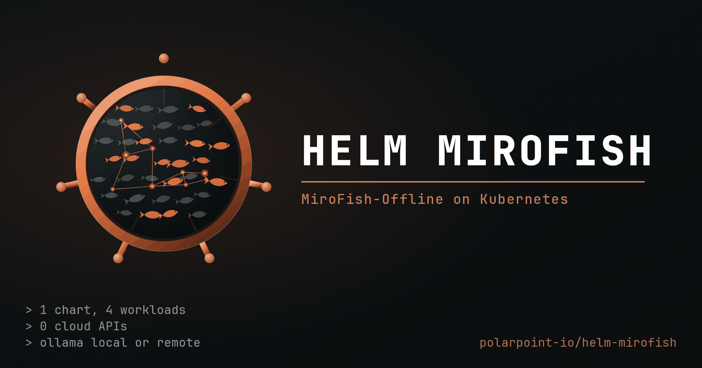

<div align="center">



</div>

# helm-mirofish

Kubernetes deployment for [MiroFish-Offline](https://github.com/nikmcfly/MiroFish-Offline) — a multi-agent swarm-intelligence engine that simulates public reaction to a document, running entirely on local models.

This repository contains three things:

| | |
|---|---|
| `charts/mirofish-offline` | A Helm chart that deploys the app, its Neo4j knowledge graph and its Ollama inference server. |
| `docker/` | Production Dockerfiles built from pinned upstream source. Upstream ships a single dev-mode image; these split it into a gunicorn API and an nginx-served frontend. |
| `.github/workflows/` | Image builds to GHCR, chart validation, and chart releases as OCI artifacts. |

Upstream source is **not vendored** — the commit built against is pinned in [`UPSTREAM_REF`](./UPSTREAM_REF) and fetched at build time.

One upstream artefact *is* replaced. `backend/uv.lock` upstream is the pre-fork lockfile: it still names the project `mirofish-backend 0.1.0` and still carries `zep-cloud`, the cloud dependency this fork removed. `uv sync` against it fails with `Missing workspace member mirofish-offline-backend`, so this repo vendors a regenerated lock at `docker/backend-uv.lock` and builds with `--locked`. Repinning `UPSTREAM_REF` to a commit whose dependencies changed will fail the build rather than silently install the wrong tree; `make relock` fixes it.

## Quick start

```bash
helm install mirofish oci://ghcr.io/polarpoint-io/charts/mirofish-offline \
  --namespace mirofish --create-namespace \
  --set neo4j.auth.password='<something-you-choose>' \
  --set ollama.gpu.enabled=true
```

Then wait for the models to download — this is the slow part, not the install:

```bash
kubectl logs -n mirofish -f job/mirofish-mirofish-offline-ollama-model-pull-1
kubectl port-forward -n mirofish svc/mirofish-mirofish-offline-web 8080:80
```

Open <http://localhost:8080>.

Already running Ollama somewhere — another namespace, another cluster, a workstation with a GPU? Point the chart at it instead of deploying another:

```bash
helm install mirofish oci://ghcr.io/polarpoint-io/charts/mirofish-offline \
  --namespace mirofish --create-namespace \
  --set neo4j.auth.password='<something-you-choose>' \
  --set ollama.enabled=false \
  --set ollama.externalUrl=http://10.0.0.42:11434
```

That drops the Ollama StatefulSet, its Services and its PVC. The [chart README](./charts/mirofish-offline/README.md#using-an-external-ollama) covers the four things that usually go wrong — chiefly that Ollama binds loopback by default and needs `OLLAMA_HOST=0.0.0.0:11434` to be reachable at all.

Without a GPU and without an external server, use a smaller model — `qwen2.5:32b` on CPU will not finish a simulation in reasonable time:

```bash
helm install mirofish oci://ghcr.io/polarpoint-io/charts/mirofish-offline \
  -f charts/mirofish-offline/ci/small-model-values.yaml \
  --namespace mirofish --create-namespace
```

## What gets deployed

```
                    ingress (optional)
                          │
                    ┌─────▼──────┐
                    │    web     │  nginx, serves the built Vue SPA
                    │ Deployment │  and proxies /api onward
                    └─────┬──────┘
                          │
                    ┌─────▼──────┐
                    │    api     │  Flask + gunicorn, 1 replica
                    │ Deployment │  PVC: uploads, personas, reports
                    └──┬──────┬──┘
              bolt:7687│      │:11434
              ┌────────▼─┐  ┌─▼──────────┐
              │  neo4j   │  │   ollama   │
              │StatefulSet│ │StatefulSet │  PVC: model weights
              │ PVC: data │ │ optional GPU│
              └──────────┘  └────────────┘
                                  ▲
                       ollama.enabled=false swaps
                       this for any URL you supply
                                  ▲
                            ┌─────┴──────┐
                            │ model-pull │  Job, pulls chat + embedding
                            │    Job     │  models after install/upgrade
                            └────────────┘
```

Four constraints shape the chart, all inherited from how the application works:

- **The API cannot be scaled.** Simulations run as subprocesses managed by the serving process, and task progress is held in memory. `api.replicaCount` above 1 is rejected outright rather than silently producing a broken deployment. The `uploads` PVC is `ReadWriteOnce` for the same reason, and the deployment strategy is `Recreate`.
- **Neo4j Community Edition is single-instance.** Clustering requires Enterprise.
- **Ollama holds model weights on a `ReadWriteOnce` volume**, so it is also single-instance. More inference throughput means a bigger GPU, not more replicas.
- **The web tier is the only stateless part**, so it is the only one with replicas, autoscaling and a disruption budget.

## Repository layout

```
charts/mirofish-offline/     the chart
  ci/                        scenario values files, all rendered in CI
  templates/
docker/
  api.Dockerfile             python:3.11 + uv + gunicorn
  web.Dockerfile             node build -> nginx-unprivileged
  nginx-default.conf.template
  backend-uv.lock            regenerated backend lockfile (see below)
docs/
  installation.md            prerequisites, sizing, install walkthroughs
  configuration.md           values reference and common changes
  operations.md              upgrades, backup, troubleshooting
  architecture.md            why the chart is shaped this way
UPSTREAM_REF                 upstream commit the images are built from
hack/
  check-names.py             object-name uniqueness and length sweep
  build-hero.py              regenerates static/hero.png (`make hero`)
static/hero.png              README banner
.releaserc.json              semantic-release configuration
commitlint.config.js         conventional commits, enforced
Makefile                     build, lint, validate, install
```

## Local development

```bash
make upstream        # clone the pinned upstream source into ./upstream
make check-lock      # confirm docker/backend-uv.lock matches upstream's pyproject
make images          # build both images locally
make check           # helm lint + render every ci/ scenario + kubeconform
make install NAMESPACE=mirofish
make test
```

`make check` and `make check-lock` are exactly what CI runs, so a green local run means a green PR.

The API image is large — roughly 8GB, dominated by the ML stack `camel-ai` pulls in. Expect the first build to take a while; the workflow caches layers between runs.

## Releasing

Releases are driven by [semantic-release](https://semantic-release.gitbook.io/), the same as the rest of the estate. There is no version to bump by hand and no tag to remember.

Merge a conventional commit to `main` and the `release` workflow does the rest:

| Commit prefix | Effect |
|---|---|
| `fix:` | patch — 0.2.0 → 0.2.1 |
| `feat:` | minor — 0.2.0 → 0.3.0 |
| `feat!:`, or a `BREAKING CHANGE:` footer | major — 0.2.0 → 1.0.0 |
| `chore:`, `docs:`, `ci:`, `test:` | no release |

In order: `make check` runs, `semantic-release-helm3` writes the new version into `Chart.yaml` and pushes the packaged chart to `oci://ghcr.io/polarpoint-io/charts`, a `CHANGELOG.md` entry and a GitHub release are generated, and a `v<version>` tag is pushed. That tag is what builds and publishes `ghcr.io/polarpoint-io/mirofish-offline-{api,web}:<version>`.

Two details worth knowing. `appVersion` is **not** touched — `onlyUpdateVersion` is set, because `appVersion` records which upstream MiroFish is inside and moves only when `UPSTREAM_REF` does. And the release runs under a PAT rather than `GITHUB_TOKEN`, because pushes made with `GITHUB_TOKEN` do not trigger workflows, which would leave the tag sitting there with no images ever built.

A commit that does not parse as conventional simply produces no release. `commitlint.config.js` is there to catch that at commit time rather than in a week's silence.

To pick up new upstream code:

```bash
make upstream-latest     # repins UPSTREAM_REF to upstream HEAD
make relock              # regenerate docker/backend-uv.lock for the new ref
git commit -am "feat: repin upstream to $(cat UPSTREAM_REF)"
```

`feat:` rather than `build:` if you want that to cut a release — new upstream code is a new version of what this chart ships. Remember to move `appVersion` in the same commit; semantic-release deliberately leaves it alone.

## Licence

AGPL-3.0-only, matching upstream. The images build and redistribute upstream code, so the chart carries the same terms. See [LICENSE](./LICENSE).
